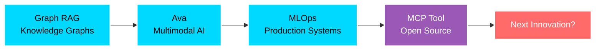

<div align="center">

# 👋 Hey, I'm Om Manoj Sharma

### AI Engineer Who Ships Production Systems, Not Just Demos


</div>

---

## 🚀 What I Build

```python
class AIEngineer:
    def __init__(self):
        self.name = "Om Manoj Sharma"
        self.role = "Production AI Engineer"
        self.focus = ["Multi-Agent Systems", "Voice AI", "MLOps","Classical ML"]
        self.mindset = "Ship fast, iterate faster"
    
    def current_status(self):
        return {
            "🎯 Building": "Agentic AI systems that solve real problems",
            "📚 Learning": "Deploying LLMs, Multimodal reasoning",
            "🔍 Seeking": "AI Engineering roles",
            "🌍 Location": "India | Open to Remote"
        }
    
    def stats(self):
        return {
            "open_source_featured": "LobeHub MCP Marketplace",
            "projects_shipped": "10+ AI/ML systems",
            "architecture_complexity": "Multi-modal, Multi-agent, Graph-based",
            "learning_velocity": "New framework → Production in 1 week"
        }
```

<div align="center">

### 🚀 Systems I've Built

</div>

<table>
<tr>
<td width="33%">

#### 🧠 Ava - Multimodal Agent
[**View Project →**](https://github.com/oms0401/Multimodal-agentic-chatbot)

- 🎭 **3+ modalities**: Voice, Vision, Text
- 💾 **35% better context** via persistent memory
- ⚡ **<2.5s response** latency
- 🔧 LangGraph, Llama 3.2, Qdrant, ElevenLabs

</td>
<td width="33%">

#### 🔄 MLOps Car Price Predictor
[**View Project →**](https://github.com/oms0401/MLops-Car-price)

- 📊 Full **CI/CD pipeline** on AWS
- ⚡ **Containerized** FastAPI service
- 🎯 **Production-ready** deployment
- 🔧 AWS (EC2, S3, ECR), Docker, GitHub Actions

</td>
<td width="33%">

#### 🕸️ Graph RAG - MOSDAC Data
[**View Project →**](https://github.com/oms0401/Graph-Rag)

- 🇮🇳 India's **MOSDAC satellite** data
- 🔗 **Knowledge graph** powered RAG
- 🧠 Advanced **retrieval** architecture
- 🔧 Neo4j, LangChain, Graph embeddings

</td>
</tr>
</table>

<div align="center">

### 🛠️ Open Source Contribution

[](https://lobehub.com/pl/mcp/oms0401-repopack-mcp-git-flatner)

**Featured on LobeHub** • Git repository flattening tool for MCP • Streamlines code context for AI agents

</div>

---

<div align="center">

## 🛠️ Tech Arsenal

### Core Stack


### AI/ML Frameworks


### Vector DBs & Tools


</div>

---

## 📊 GitHub Stats

<div align="center">
  


</div>

<div align="center">


</div>

---

## 🎯 What Makes Me Different


```yaml
mindset:
  - "Ship fast, iterate faster"
  - "Production > Perfection"
  - "Learn by building, not just reading"

approach:
  design: "Start with latency budget, not features"
  code: "Clean, maintainable, scalable"
  deploy: "Monitor everything, assume nothing"

philosophy:
  - Bridge the gap: "Notebook → Production"
  - Solve real problems for real users
  - Metrics over opinions
  
current_exploration:
  - Advanced multi-agent coordination
  - Multimodal reasoning systems
  - Cost-optimized production LLM systems
```

---


## 📈 The Journey



---

<div align="center">

## 📫 Let's Build Something Amazing

[](https://www.linkedin.com/in/om-manoj-sharma-b87b22291/)
[](oms0401vns@gmail.com)


---

### 💡 Currently Open To

🚀 **AI/ML Engineering roles** building agentic systems and production MLOps  
🤝 **Open Source collaborations** on LLM tooling and agent frameworks  
🔬 **Research projects** in multimodal AI and knowledge graphs  


---

<div align="center">

### 🎖️ Recognition

**Featured on LobeHub MCP Marketplace** • Tool used by AI developers globally

</div>

---


</div>

---

<details>
<summary>📚 More About My Tech Philosophy</summary>

<br>

### Why I Build What I Build

I don't chase every new model release. Instead, I focus on:

1. **Production-Ready Systems**: If it can't handle real users at scale, it's not done
2. **Measurable Impact**: Every system should have clear metrics (latency, accuracy, cost)
3. **Clean Architecture**: Future-me should thank present-me for maintainable code
4. **Learn by Shipping**: Theory is great, but nothing beats production debugging at 2 AM

### My Learning Approach

```python
def learn_new_tech(technology):
    """How I approach learning"""
    steps = [
        "Read official docs (30 mins)",
        "Build tiny prototype (2 hours)",
        "Break it, fix it, understand edge cases (1 day)",
        "Build something real with it (1 week)",
        "Write about what I learned (optional but valuable)"
    ]
    
    return "Now I actually know it, not just know about it"
```

### What I'm Reading Now

- **Papers**: Constitutional AI, Anthropic's research on agent safety
- **Code**: LangGraph source code, studying state management patterns
- **Blogs**: Simon Willison on LLMs, Eugene Yan on ML systems
- **Books**: Designing Data-Intensive Applications (re-reading)

</details>

---

<div align="center">

### ⚡ Fun Fact

```javascript
const lifeBalance = {
  code: "60%",
  learn: "20%", 
  build_side_projects: "15%",
  coffee: "∞%",  // Runs in parallel
  sleep: "Async operation, still pending..."
};
```

**"The best code is the code that ships. The second best is the code that's readable when debugging at 2 AM."**

</div>
